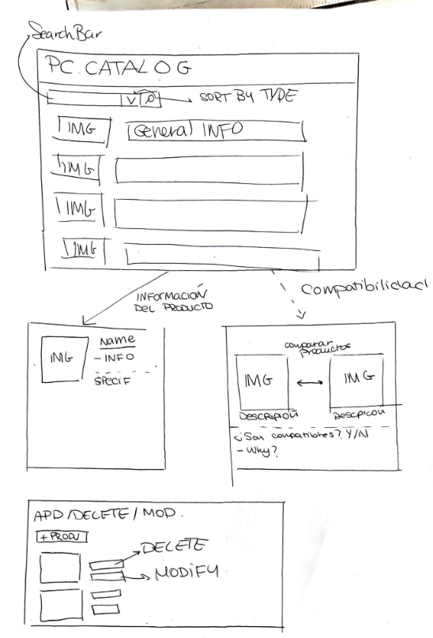

# webapp09

# PC Parts Catalog

## Web Fundamentals

### Project 2026–2027

**Application name:** PC Parts Catalog
**Subject:** Web Fundamentals
**Degree:** Software Engineering
**Academic year:** 2026–2027

## Team Members

| Name                             | University Email                                                          | GitHub                                                        |
| -------------------------------- | ------------------------------------------------------------------------- | ------------------------------------------------------------- |
| **Pablo Montes Gilete**          | [p.montes.2025@alumnos.urjc.es](mailto:p.montes.2025@alumnos.urjc.es)     | [pMOGI134](https://github.com/pMOGI134)                       |
| **Yoel Alejandro Adán González** | [ya.adan.2025@alumnos.urjc.es](mailto:ya.adan.2025@alumnos.urjc.es)       | [yoelaleadan-wq](https://github.com/yoelaleadan-wq)           |
| **Alvaro Pastrana Lopez**        | [a.pastrana.2025@alumnos.urjc.es](mailto:a.pastrana.2025@alumnos.urjc.es) | [pastranalvaro30-png](https://github.com/pastranalvaro30-png) |

# Application Description

**PC Parts Catalog** will be a web application designed for the consultation and management of computers and their components.

The application will allow users to browse different computer builds, view their main characteristics, and access their technical information.

The computers will be organized into different categories, such as high-end computers, modern computers, and low-end computers. Users will also be able to view the different components included in each computer.

The application will provide search and categorization functionalities to make it easier to find and organize the different computers.

Additionally, the application will include a **Compatibility Checker** that will allow users to check whether two components are compatible with each other.

The compatibility system will be a basic hardware compatibility system focused on component connections and specifications. Software-related aspects, such as BIOS compatibility, will not be considered.

# Functionality

## Entities

The application will manage two main entities:

* **Computer:** The main entity of the application.
* **Component:** The secondary entity, which represents the hardware components that make up a computer.

### Main Entity: Computer

The `Computer` entity represents a complete computer build.

Its main attributes will be:

| Attribute      | Description                                   |
| -------------- | --------------------------------------------- |
| `Name`         | Name of the computer                          |
| `Brand`        | Computer manufacturer                         |
| `Type`         | Computer type                                 |
| `Description`  | Description of the computer                   |
| `Price`        | Price of the computer                         |
| `Release Date` | Computer release date                         |
| `Image`        | Image representing the computer               |
| `Used`         | Indicates whether the computer is second-hand |

### Secondary Entity: Component

The `Component` entity represents a hardware component that can be included in a computer.

Its attributes will be:

| Attribute     | Description                      |
| ------------- | -------------------------------- |
| `Name`        | Name of the component            |
| `Brand`       | Component manufacturer           |
| `Type`        | Component type                   |
| `Description` | Description of the component     |
| `Price`       | Price of the component           |
| `Image`       | Image representing the component |

For example, a component could have the following technical specifications:

| Name        |    Value | Unit |
| ----------- | -------: | ---- |
| VRAM        |       12 | GB   |
| Memory Type |    GDDR7 | —    |
| TDP         |      250 | W    |
| Interface   | PCIe 5.0 | —    |

## Entity Relationship

Each `Computer` can have several `Component` objects associated with it.

Each `Component` can belong to a computer.

Therefore, the relationship between the two entities is **one-to-many (1:N)**.

For example:

```text
Gaming PC
│
├── CPU → AMD Ryzen 7 7800X3D
├── GPU → NVIDIA GeForce RTX 5070
├── RAM → 32 GB DDR5
├── Storage → 1 TB NVMe SSD
└── PSU → 750 W
```

The components are associated with the computer to which they belong.

## Images

Each object of the `Computer` entity will have at least one image representing the computer.

The images will be displayed both in the main catalog and on the computer detail page.

Components will also have an image representing the hardware component.

## Search and Categorization

### Search

The application will allow users to search for computers by name.

For example, the user could search for:

```text
Gaming PC
```

The application will then display the computers matching the search.

### Categorization

Computers will be classified according to their type.

The initial categories will be:

* High-End Computer
* Modern Computer
* Low-End Computer

Components will also be classified according to their type.

The initial component categories will be:

* CPU
* GPU
* Motherboard
* RAM
* Storage
* PSU
* Case
* Cooling System

The user will be able to select a category and display only the computers or components belonging to that category.

## Compatibility Checker

The application will include a dedicated interface for checking the compatibility between two components.

The user will select two components and the application will compare the relevant technical specifications.

The system will perform four initial compatibility checks:

| Components        | Compatibility criterion               |
| ----------------- | ------------------------------------- |
| CPU ↔ Motherboard | CPU socket and motherboard socket     |
| Motherboard ↔ RAM | RAM memory type, such as DDR4 or DDR5 |
| GPU ↔ Motherboard | PCIe interface compatibility          |
| GPU ↔ PSU         | Sufficient power supply capacity      |

### CPU ↔ Motherboard

The system will check whether the CPU socket is compatible with the motherboard socket.

### Motherboard ↔ RAM

The system will compare the supported memory type of the motherboard with the memory type of the RAM.

For example:

```text
Motherboard → DDR5
RAM → DDR5

✓ Compatible
```


# Computer Management

The application will allow users to manage the computers stored in the catalog.

The following operations will be available:

* **Create:** Add a new computer to the catalog.
* **Modify:** Update the information of an existing computer.
* **Delete:** Remove an existing computer.
* **Modify Image:** Replace the image associated with a computer.


# Example of Use

A possible computer in the catalog could be:

```text
Name: Gaming PC
Brand: Custom Build
Type: High-End Computer
Price: 1899.99 €
Description: High-performance desktop computer designed for gaming.
```

This computer could have the following components:

```text
CPU → AMD Ryzen 7 7800X3D
GPU → NVIDIA GeForce RTX 5070
RAM → 32 GB DDR5
Storage → 1 TB NVMe SSD
PSU → 750 W
```

The GPU component could have the following technical specifications:

```text
VRAM → 12 GB
Memory Type → GDDR7
Interface → PCIe 5.0
TDP → 250 W
```

From the main page, the user could search for:

```text
Gaming PC
```

The application would display the corresponding computer. The user could then access its detail page and view all its information and the components included in the build.

# Application Structure

The application will consist of several main pages:

### Main Catalog Page

The main page will display the available computers in a catalog.

Each computer will show its image and main information.

The user will be able to search for computers and filter them by category.

### Computer Detail Page

This page will display the complete information of a selected computer, including its components.

### Component Detail Page

This page will display the complete information of a selected component, including its technical specifications.

# Project Preview



